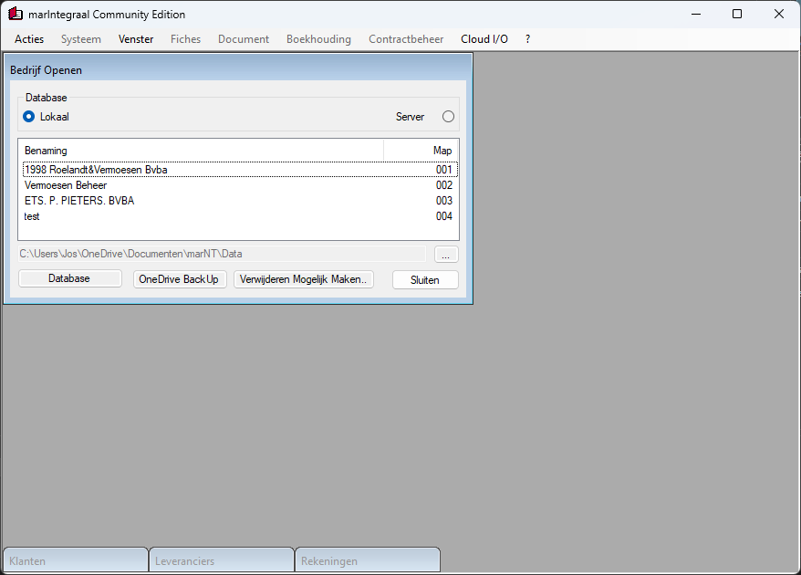

# marintegraal

## [ClickOnce][ClickOnce]

## History

marIntegraal stands for compleet accounting around Minimumindeling Algemeen Rekeningstelsel (Dutch Belgium).

- It is a project first commercialized end of 1985 for Amstrad/Schneider PCW sytems, written in Mallard BASIC using B-Plus tree index sorting on CP/M.
- TODO

[ClickOnce]: https://clickonce.vsoft.be/MarIntegraal/publish.htm